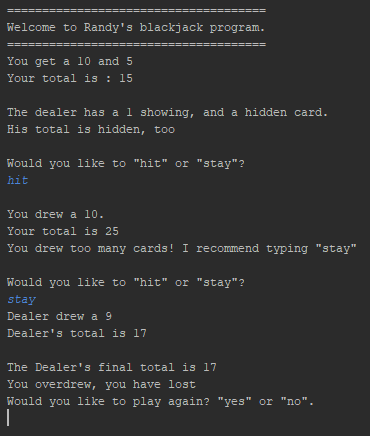

# About
A simple blackjack program that lets you "hit" or "stay". Even after overdrawing 21, it does not stop you from hitting again.
I maybe plan on fixing that section and maybe how the dealer draws the cards and when to stay.

# Focus
* Random
* Scanner
* Do-While
* If, else-if

# Image

