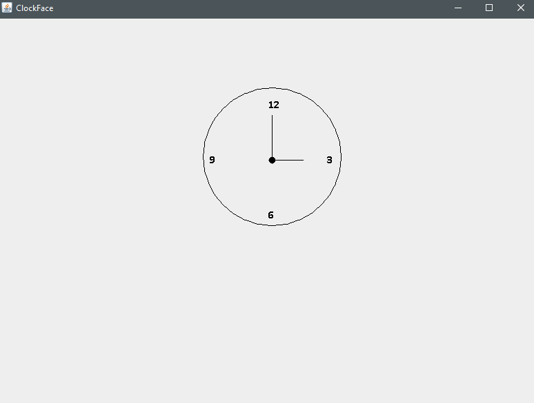

# About
A program that displays a simple clock with hands


# Quick Reference
```sh
g.drawOval(x,y,w,h);
g.drawString("String Here", x,y);
g.drawLine(x1,y1,x2,y2);
g.setFont(new Font("Calibri", Font.BOLD, ft. Size);
g.setColor(Color.BLACK);
```

# Focus
* drawString
* drawLine
* setFont

# Image

