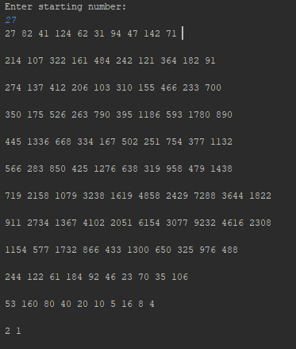

# About
A program that display the Collaz Sequence with user given a value.
Collatz sequence is numbers relevant to the Collatz conjecture, which theorizes that any uses this algorithm will eventually be reduced to 1.

If the value is even, the value is divided by 2.
If the value is odd, the value is multiplied by 3 and added by 1

# Image

