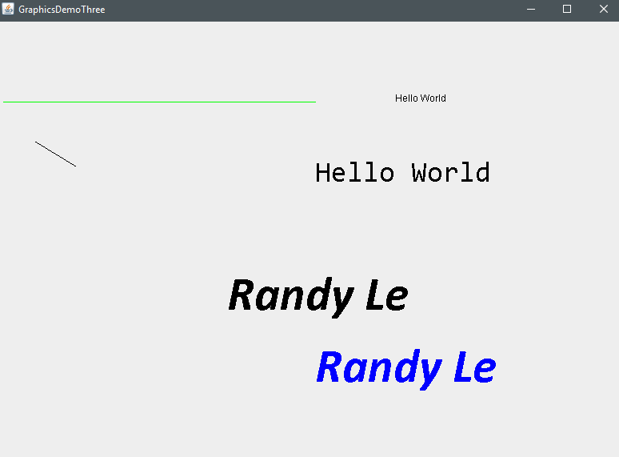

# About
A program that shows way of editing fonts.

# Quick-Reference
```sh
g.setFont(new Font("font-name", Font.BOLD, font-size));
g.setFont(Font.decode("Calibri-BOLDITALIC-60"));
g.setFont(new Font(null));
```

# Image

