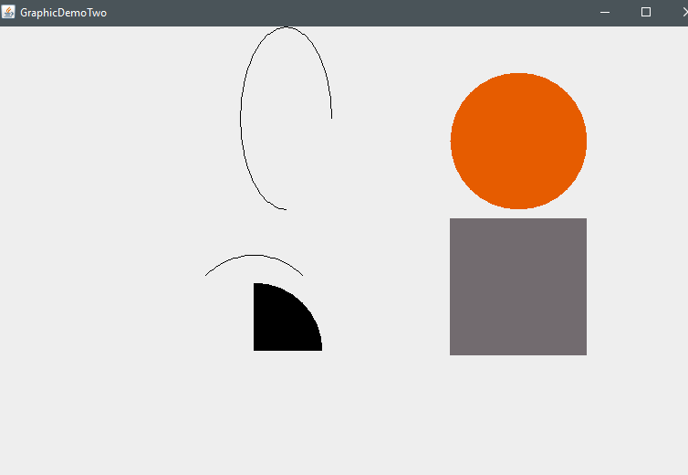

# About
A program that draws Arcs and the use of customized color

# Quick-Reference
```sh
g.drawArc(x,y,width,height,startAngle,arcAngle);
g.fillArc(x,y,width,height,startAngle,arcAngle);
Color myColor = new Color(r,g,b)
```

# Image

